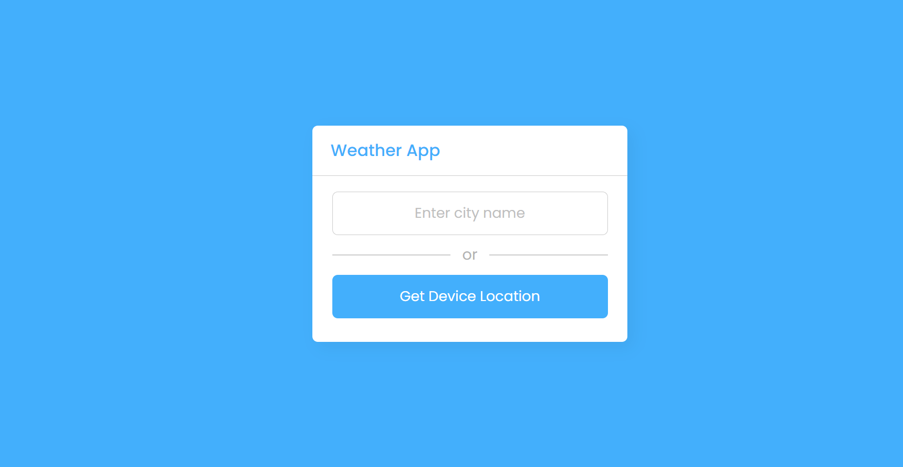
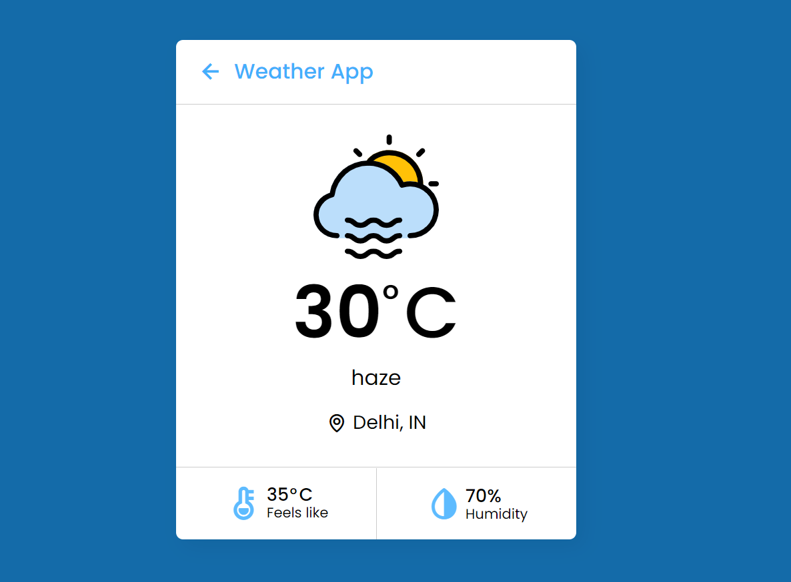

# Weather App Using Js
It is  a Weather app in which, you can get the weather details of a particular city by entering the city name or you can also get your current location weather details by clicking on the “Get Device Location” button. If you entered an invalid city name then there is shown an error message.

Tech Stack :- HTML, CSS, JAVASCRIPT

## [DEMO](https://rishikavishnoi.github.io/WeatherAppUsingJs/)

API used :- [Open Weather](https://openweathermap.org/api)

